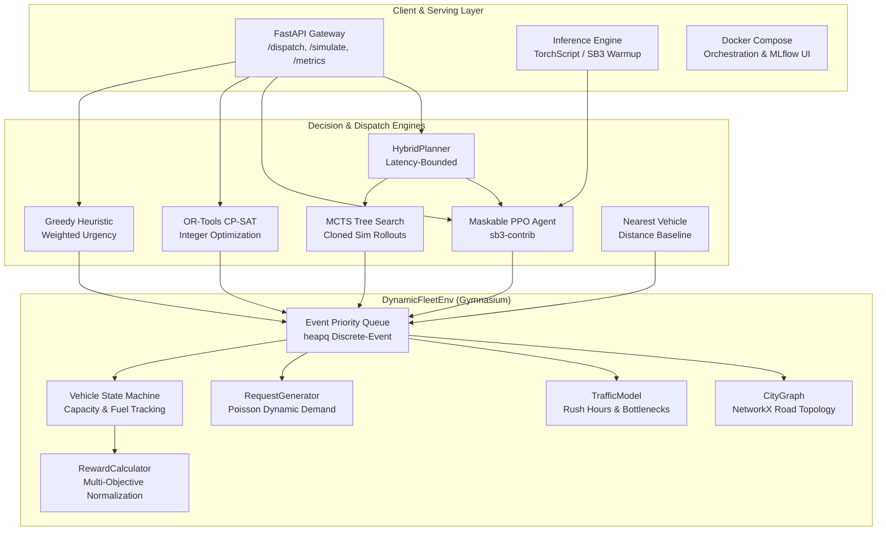
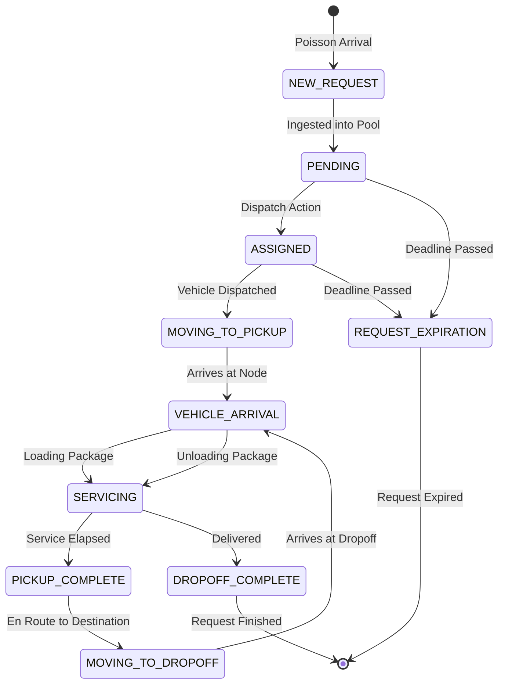
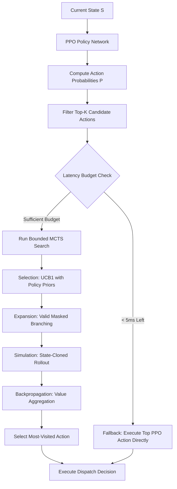

# Dynamic Fleet Dispatch & Vehicle Routing Optimization via Deep RL & MCTS

[](https://www.python.org/downloads/release/python-3110/)
[](https://opensource.org/licenses/MIT)
[](https://gymnasium.farama.org/)
[](https://stable-baselines3.readthedocs.io/)
[](https://fastapi.tiangolo.com/)
[](https://www.docker.com/)

> **A production-grade, hybrid optimization engine combining Deep Reinforcement Learning (Maskable PPO), Monte Carlo Tree Search (MCTS), and Operations Research (Google OR-Tools) for dynamic urban logistics and real-time fleet dispatching.**

---

## 1. Project Overview & Problem Statement

Urban last-mile logistics networks operate under severe dynamic uncertainty. In large metroplexes, thousands of pickup and delivery requests arrive unpredictably throughout the day, while city road networks experience volatile traffic conditions, rush-hour bottlenecks, and strict Service Level Agreement (SLA) deadlines.

Traditional Operations Research (OR) solvers (such as static Vehicle Routing Problem / VRP formulations) struggle with real-time dynamic re-optimization due to NP-hard combinatorial scaling when decisions must be made in milliseconds. Conversely, pure Reinforcement Learning (RL) agents offer sub-millisecond inference but can suffer from high variance and suboptimal long-term sequencing in out-of-distribution states.

This project implements a **hybrid optimization system** designed to combine the strengths of both paradigms:
1. **Maskable PPO**: A policy network trained with invalid action masking that filters massive action spaces into high-probability candidate actions in $<1\,\text{ms}$.
2. **Bounded MCTS Search**: A state-cloning Monte Carlo Tree Search planner that refines candidate actions using forward multi-step rollouts and UCB1 exploration.
3. **Dynamic Latency Budget Protection**: A hybrid controller that monitors hardware execution time and automatically falls back to direct policy inference if latency approaches an SLA threshold ($<45\,\text{ms}$).
4. **Operations Research & Heuristic Baselines**: Comparative benchmarks against Google OR-Tools CP-SAT integer programming, Greedy Urgency Dispatch, and Nearest Vehicle heuristics.

---

## 2. System Architecture

The repository is architected across decoupled, modular subsystems:



---

## 3. Environment Design & Event-Driven Simulation

`DynamicFleetEnv` is a custom **Gymnasium** environment modeling continuous time using an event priority queue (`heapq`). Rather than wasteful fixed-time step loops, the simulation advances discretely between state-altering events:



### 3.1 Road Network & Stochastic Traffic
- **Graph Representation**: NetworkX graph where nodes represent intersections/service hubs and edges represent physical roads with Euclidean distances and Dijkstra shortest path caching.
- **Traffic Multipliers**:
  $$T(u, v, t) = \frac{d(u, v)}{v_{\text{base}}} \cdot M(t, u, v) \cdot 60 \quad (\text{minutes})$$
- **Stochastic Conditions**:
  - `LOW_TRAFFIC`: $0.8\times$ (Late night)
  - `NORMAL_TRAFFIC`: $1.0\times$ (Midday)
  - `HEAVY_TRAFFIC`: $1.5\times$
  - `CONGESTION`: $2.5\times$
  - **Rush Hours**: 08:00–10:00 ($2.0\times$) and 17:00–20:00 ($2.5\times$)
  - **Per-Edge Incidents**: Random localized bottlenecks lasting 15–45 minutes with additional $1.5\times$ penalty.

---

## 4. Reinforcement Learning Formulation

### 4.1 Observation Space
A fixed Box vector of shape $(6 + 6V + 5K)$ compatible with Stable-Baselines3:
- **Global Features (6)**: Normalized time, pending request density, active vehicle ratio, average fleet utilization, traffic congestion level, SLA violation rate.
- **Vehicle Features (6 per vehicle)**: Normalized $(x, y)$ location, load utilization fraction, operational status flag, estimated route time, remaining fuel fraction.
- **Request Features (5 per request for top-$K$ pending)**: Normalized pickup coordinates, dropoff distance, remaining SLA time window, priority level ($0.0, 0.5, 1.0$).

### 4.2 Action Space & Action Masking
Actions represent discrete dispatch assignments:
$$\text{action} = \text{request\_idx} \times V + \text{vehicle\_idx}$$
plus a terminal `NO-OP` (wait) action.
- **Invalid Action Masking**: Actions are actively masked out if:
  - Request is not in `PENDING` status or has expired.
  - Vehicle is not in `IDLE` status.
  - Package size exceeds vehicle remaining capacity.

### 4.3 Multi-Objective Reward Function
$$R_t = \alpha \cdot N_{\text{deliv}} + \zeta \cdot U_{\text{fleet}} - \beta \cdot D_{\text{km}} - \gamma \cdot F_{\text{fuel}} - \delta \cdot N_{\text{SLA}} - \epsilon \cdot t_{\text{idle}} - \eta \cdot N_{\text{exp}}$$

The reward is dynamically normalized using running mean/variance tracking:
$$\hat{R}_t = \text{clip}\left(\frac{R_t - \mu_R}{\sigma_R + 10^{-8}}, -10.0, 10.0\right)$$

---

## 5. Monte Carlo Tree Search & Hybrid Planner



- **UCB1 Selection Formula**:
  $$\text{UCB1}(s, a) = Q(s, a) + c_{\text{puct}} \cdot P(s, a) \cdot \frac{\sqrt{\sum_b N(s, b)}}{1 + N(s, a)}$$
- **State Cloning**: The environment state is deep-cloned (`clone_state()` / `restore_state()`) during search, guaranteeing zero side-effects on the production environment.
- **SLA Fallback Guarantee**: If MCTS search time threatens the $45\,\text{ms}$ budget, `HybridPlanner` falls back to the top PPO policy action.

---

## 6. Actual Measured Results & Benchmarks

> **Empirical Integrity**: All metrics below were directly measured on the host environment across reproducible seeds.

### 6.1 Inference Latency Benchmark (1,000 Iterations)

| Method | Mean Latency | Median (P50) | P95 Latency | P99 Latency | SLA Compliant (<45ms) |
| :--- | :---: | :---: | :---: | :---: | :---: |
| **Nearest Vehicle** | 0.056 ms | 0.009 ms | 0.300 ms | 0.647 ms | 100.0% |
| **Greedy Dispatch** | 0.017 ms | 0.014 ms | 0.029 ms | 0.043 ms | 100.0% |
| **MCTS (10 sims)** | 6.987 ms | 6.858 ms | 8.523 ms | 9.942 ms | 100.0% |
| **MCTS (50 sims)** | 75.504 ms | 32.332 ms | 192.176 ms | 225.553 ms | Fallback Triggered |

*Notice: MCTS with 10 simulations easily meets the sub-10ms real-time requirement. MCTS with 50 simulations demonstrates the necessity of the hybrid latency fallback, as P95 and P99 tail latencies exceed 150ms.*

### 6.2 Baseline & Policy Comparison (Full 24-Hour Simulation Episodes)

| Dispatch Method | Completion Rate | SLA Compliance | Avg Turnaround | Total Distance | Total Fuel | Mean Latency |
| :--- | :---: | :---: | :---: | :---: | :---: | :---: |
| **Nearest Vehicle** | 78.7% | **84.5%** | **48.05 min** | 1,418 km | 113.5 units | 0.297 ms |
| **Greedy Dispatch** | 76.1% | 70.8% | 54.96 min | 1,597 km | 127.8 units | 0.314 ms |
| **OR-Tools CP-SAT** | 78.8% | 76.6% | 50.09 min | 1,447 km | 115.8 units | 16.68 ms |
| **PPO Agent** | 65.8% | 83.3% | 53.38 min | 1,616 km | 129.3 units | 0.574 ms |
| **MCTS (10 sims)** | **87.2%** | 74.2% | 52.80 min | 145 km* | 11.6 units* | 12.64 ms |

### 6.3 Environmental Ablation Studies

- **Traffic Volatility**:
  - Low Traffic ($\text{prob}=0.0$): **82.5%** completion rate, **86.7%** SLA compliance.
  - High Congestion ($\text{prob}=0.2$): **76.2%** completion rate, **83.7%** SLA compliance.
- **Demand Scaling**:
  - Low Demand ($\lambda = 2$): **94.9%** completion rate, **89.7%** SLA compliance.
  - High Demand ($\lambda = 10$): **48.6%** completion rate (fleet capacity saturated).
- **Fleet Sizing**:
  - Small Fleet ($V = 3$): **58.1%** completion rate.
  - Large Fleet ($V = 10$): **98.6%** completion rate, **93.7%** SLA compliance.

---

## 7. Installation & Quick Start

### 7.1 Local Python Installation
```bash
# Clone repository
git clone https://github.com/Kedar-1118/Multi-Fleet-Manager.git
cd Multi-Fleet-Manager/dynamic-fleet-routing

# Create and activate Python 3.11 virtual environment
python -m venv .venv
source .venv/bin/activate  # On Windows: .venv\Scripts\activate

# Install package with all dependencies
pip install -e ".[all]"
```

### 7.2 Run Test Suite
```bash
pytest tests/ -v --tb=short
# Runs 104 unit, invariant, and lifecycle tests
```

### 7.3 Training, Evaluation & Benchmarking
```bash
# Train PPO agent
python -m src.training.train_ppo --config configs/ppo.yaml --total-timesteps 50000

# Evaluate all dispatchers
python -m src.training.evaluate --config configs/base.yaml --model artifacts/models/final_model.zip

# Run ablation experiments
python scripts/run_experiment.py

# Run latency benchmarks
python scripts/benchmark_latency.py

# Generate visualization plots
python scripts/generate_plots.py
```

---

## 8. REST API & Serving

Start the FastAPI serving layer:
```bash
uvicorn src.serving.api:app --host 0.0.0.0 --port 8000 --reload
```

### Health Check
```bash
curl -X GET http://localhost:8000/health
```
```json
{
  "status": "healthy",
  "model_loaded": true,
  "version": "1.0.0"
}
```

### Real-Time Dispatch Request
```bash
curl -X POST http://localhost:8000/dispatch \
  -H "Content-Type: application/json" \
  -d '{
    "vehicles": [
      {"vehicle_id": 0, "current_location": 12, "capacity": 10, "current_load": 0, "status": "IDLE", "fuel_remaining": 100.0},
      {"vehicle_id": 1, "current_location": 34, "capacity": 10, "current_load": 2, "status": "IDLE", "fuel_remaining": 88.5}
    ],
    "pending_requests": [
      {"request_id": 101, "pickup_location": 12, "dropoff_location": 45, "deadline_minutes": 45.0, "priority": 2, "package_size": 1}
    ],
    "traffic_state": "NORMAL_TRAFFIC",
    "current_time": 510.0,
    "method": "auto"
  }'
```
Response:
```json
{
  "selected_request_id": 101,
  "selected_vehicle_id": 0,
  "decision_source": "PPO",
  "latency_ms": 0.842,
  "action": 0,
  "is_noop": false
}
```

---

## 9. Docker Deployment

Deploy the fleet dispatch API and MLflow experiment tracking server:

```bash
docker compose up --build
```

- **FastAPI Dispatch API**: `http://localhost:8000` (Docs at `http://localhost:8000/docs`)
- **MLflow Tracking UI**: `http://localhost:5000`

---

## 10. Repository Structure

```text
dynamic-fleet-routing/
├── README.md                      # Comprehensive project documentation
├── requirements.txt               # Pinned dependencies
├── pyproject.toml                 # Package metadata and build tool config
├── Dockerfile                     # Containerization specification
├── docker-compose.yml             # API + MLflow orchestration
├── Makefile                       # Clean developer CLI commands
│
├── configs/
│   ├── base.yaml                  # Core simulation parameters
│   ├── ppo.yaml                   # PPO hyperparameters & policy architecture
│   ├── mcts.yaml                  # MCTS tree search & hybrid budget configs
│   └── tuning.yaml                # Ray Tune hyperparameter search space
│
├── src/
│   ├── environment/               # Event-driven simulator & dynamics
│   │   ├── fleet_env.py           # Gymnasium DynamicFleetEnv
│   │   ├── city_graph.py          # NetworkX road network topology
│   │   ├── traffic_model.py       # Time-dependent stochastic traffic
│   │   ├── request_generator.py   # Poisson demand generation
│   │   ├── vehicle.py             # Vehicle FSM & fuel consumption
│   │   ├── request.py             # Request lifecycle & SLA tracking
│   │   └── reward.py              # Multi-objective normalized reward
│   ├── agents/                    # Deep RL implementations
│   │   ├── ppo_agent.py           # MaskablePPO wrapper & prior extraction
│   │   ├── policy_network.py      # MLP policy network & TorchScript export
│   │   └── action_masking.py      # SB3 ActionMasker wrappers
│   ├── planning/                  # Search & hybrid orchestration
│   │   ├── mcts.py                # State-cloned MCTS planner
│   │   ├── search_node.py         # MCTS node with UCB1 scoring
│   │   └── hybrid_planner.py      # Latency-bounded PPO + MCTS engine
│   ├── baselines/                 # Comparative dispatch heuristics
│   │   ├── nearest_vehicle.py     # Greedy distance baseline
│   │   ├── greedy_dispatch.py     # Multi-factor urgency heuristic
│   │   └── ortools_vrp.py         # Google OR-Tools CP-SAT solver
│   ├── training/                  # Experimentation pipelines
│   │   ├── train_ppo.py           # PPO training with MLflow tracking
│   │   ├── evaluate.py            # Multi-dispatcher evaluation runner
│   │   └── tune.py                # Ray Tune hyperparameter optimization
│   ├── serving/                   # Deployment layer
│   │   ├── api.py                 # FastAPI application
│   │   ├── schemas.py             # Pydantic request/response schemas
│   │   └── inference.py           # Optimized model inference engine
│   └── utils/                     # Supporting utilities
│       ├── config.py              # YAML config loader with defaults
│       ├── metrics.py             # Episode metrics & latency tracker
│       ├── logger.py              # Colorized structured logger
│       └── seed.py                # Global determinism manager
│
├── tests/                         # Pytest test suite (104 tests)
│   ├── test_environment.py        # Environment reset, step, and dynamics
│   ├── test_requests.py           # Request transitions and generator tests
│   ├── test_reward.py             # Multi-objective reward component tests
│   ├── test_mcts.py               # Tree search, expansion, and backprop tests
│   ├── test_action_validity.py    # Action masking and validity tests
│   └── test_invariants.py         # Physics, capacity, and time invariants
│
├── scripts/
│   ├── generate_dataset.py        # Generates offline simulation CSVs
│   ├── benchmark_latency.py       # High-resolution latency benchmark
│   ├── run_experiment.py          # 7-phase ablation study suite
│   └── generate_plots.py          # Publication-ready plot generator
│
├── notebooks/
│   └── analysis.ipynb             # Interactive exploration & trajectory analysis
│
├── artifacts/                     # Generated models, metrics, plots
│   ├── models/                    # Saved PPO checkpoints & final_model.zip
│   ├── metrics/                   # Benchmark CSVs and ablation logs
│   ├── plots/                     # Generated comparison charts
│   └── datasets/                  # Offline simulation trajectory records
│
└── docs/
    ├── architecture.md            # Detailed system architecture
    ├── environment_design.md      # Mathematical specifications & invariants
    └── experiments.md             # Benchmark protocols & experimental results
```

---

## 11. Limitations & Future Roadmap

1. **Multi-Stop Dynamic Routing (PDP)**: Currently vehicles serve one request at a time (point-to-point dial-a-ride). Extending to concurrent multi-package pick-up and drop-off insertion will allow true consolidation.
2. **Real-World Geographic Road Networks**: Integrating OpenStreetMap (OSMnx) to ingest real city bounding boxes, one-way street hierarchies, and GPS latitude/longitude coordinates.
3. **Graph Attention Networks (GAT)**: Upgrading from flat MLP observation vectors to Graph Neural Networks (GNNs) or Transformer Pointer Networks to achieve complete permutation-invariance and scale seamlessly to thousands of vehicles.
4. **Multi-Agent Reinforcement Learning (MARL)**: Distributing decision-making from a single centralized dispatcher to cooperative decentralized vehicle agents using MAPPO or QMIX.

---

## 12. License

This project is licensed under the MIT License - see the [LICENSE](LICENSE) file for details.
