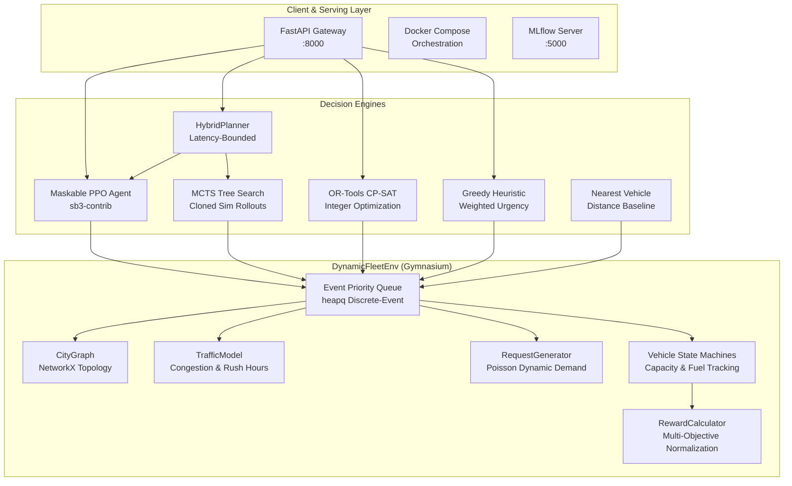
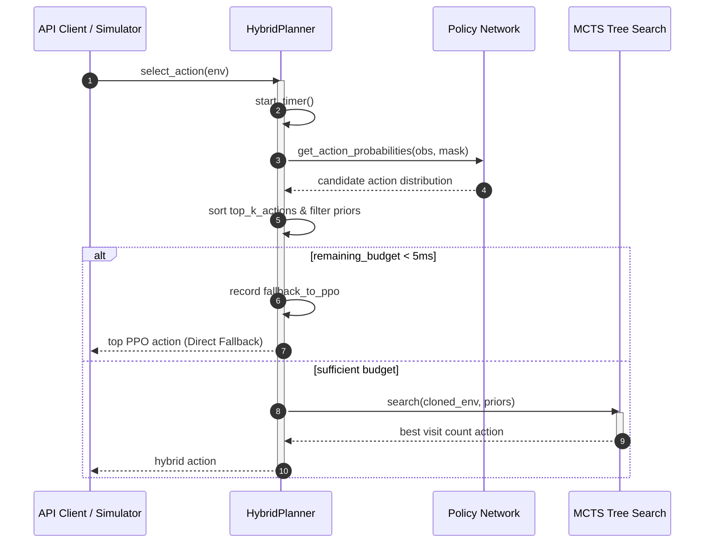

# Dynamic Fleet Routing System Architecture

## 1. System Overview

The **Dynamic Fleet Routing** system is an end-to-end optimization platform designed for high-density dynamic pickup and delivery dispatching. It pairs Deep Reinforcement Learning (Maskable PPO) with Monte Carlo Tree Search (MCTS) and Operations Research baselines (Google OR-Tools CP-SAT) to optimize fleet efficiency under stochastic traffic and tight SLA constraints.

---

## 2. Core Subsystems

### 2.1 Simulation Subsystem (`src/environment/`)
- **`DynamicFleetEnv`**: Event-driven Gymnasium simulation. Rather than fixed-time discretizations, simulation advances across discrete event timestamps (`NEW_REQUEST`, `VEHICLE_ARRIVAL`, `PICKUP_COMPLETE`, `DROPOFF_COMPLETE`, `TRAFFIC_CHANGE`, `REQUEST_EXPIRATION`).
- **`CityGraph`**: Undirected graph of city intersections and roads with Euclidean distances and Dijkstra shortest path caching. Ensures graph connectivity using minimum spanning tree edges.
- **`TrafficModel`**: Time-dependent travel multiplier incorporating morning/evening rush hours, stochastic edge congestion, and travel time variance.
- **`RequestGenerator`**: Non-homogeneous Poisson arrival process with 24-hour demand curve, priority distributions, and SLA deadlines.
- **`Vehicle`**: State machine maintaining load capacity, fuel level, operational status, and mileage metrics.
- **`RewardCalculator`**: Multi-objective reward balancing delivery completions, travel distance, fuel consumption, SLA compliance, and vehicle utilization with running z-score normalization.

### 2.2 Decision & Planning Subsystem (`src/planning/`, `src/agents/`, `src/baselines/`)
- **`PPOAgent`**: Maskable Proximal Policy Optimization network trained with `sb3-contrib`. Extracts policy prior probabilities for candidate actions.
- **`MCTSPlanner`**: Tree search engine performing selection via UCB1, node expansion, cloned rollout simulation, and backpropagation.
- **`HybridPlanner`**: Merges PPO priors with MCTS exploration. Limits candidate actions to top-$K$, tracks latency via `time.perf_counter()`, and triggers instant PPO fallback if the latency budget ($45\,\text{ms}$) is near exhaustion.
- **`ORToolsVRPDispatcher`**: Formulates pending assignments as integer linear programming bipartite matching with distance and urgency cost matrix.
- **`GreedyDispatcher`**: Cost-weighted urgency scoring balancing pickup distance, route time, and deadline proximity.

### 2.3 Serving & Deployment (`src/serving/`, `Dockerfile`, `docker-compose.yml`)
- **FastAPI**: Asynchronous REST endpoints (`/dispatch`, `/simulate`, `/health`, `/metrics`).
- **InferenceEngine**: Supports TorchScript model tracing and warm-up routines for microsecond-level dispatch latency.
- **Containerization**: Multi-stage Python 3.11 slim image running with a dedicated non-root user and automated health checks.

---

## 3. Data Contracts & Interfaces

### 3.1 Observation Space Contract
Fixed Box vector of shape $(6 + 6V + 5K)$:
1. **Global Features (6)**:
   - $\text{time} / \text{sim\_duration}$
   - $\min(|\text{pending}| / K, 1.0)$
   - $|\text{active}| / V$
   - $\text{mean}(\text{fleet utilization})$
   - $\text{traffic level} / 4.0$
   - $\text{SLA breach rate}$
2. **Vehicle Features (6 per vehicle)**:
   - Normalized $(x, y)$ coordinate
   - Current utilization ($\text{load} / \text{capacity}$)
   - Busy flag ($0.0$ or $1.0$)
   - Remaining route time
   - Remaining fuel fraction
3. **Request Features (5 per request for top-$K$)**:
   - Normalized pickup $(x, y)$
   - Normalized dropoff distance
   - Normalized remaining SLA window
   - Priority level ($0.0, 0.5, 1.0$)

### 3.2 Action Space Contract
Discrete scalar action encoding:
$$\text{action} = \text{request\_idx} \times V + \text{vehicle\_idx}$$
The final index ($K \cdot V$) is reserved for the `NO-OP` (wait/idle) action.

---

## 4. Latency Budget & Fallback Protocol

