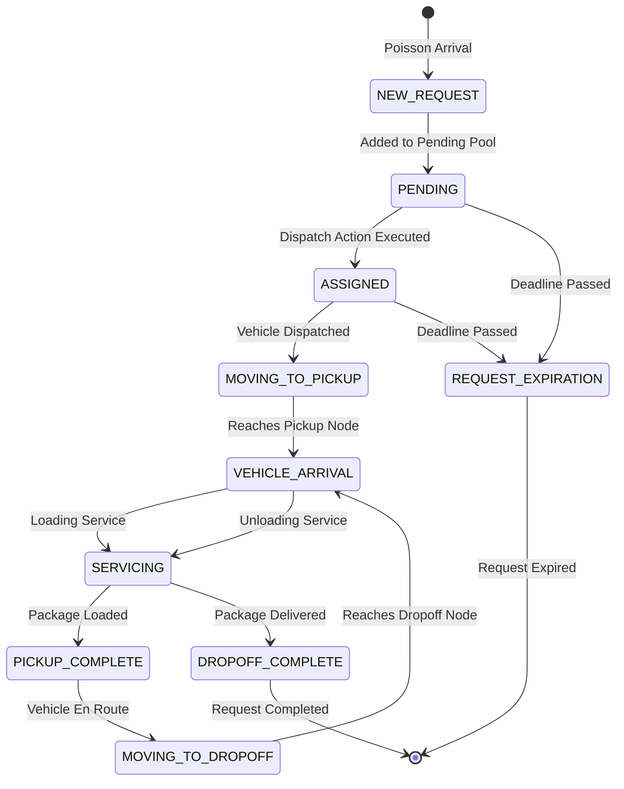
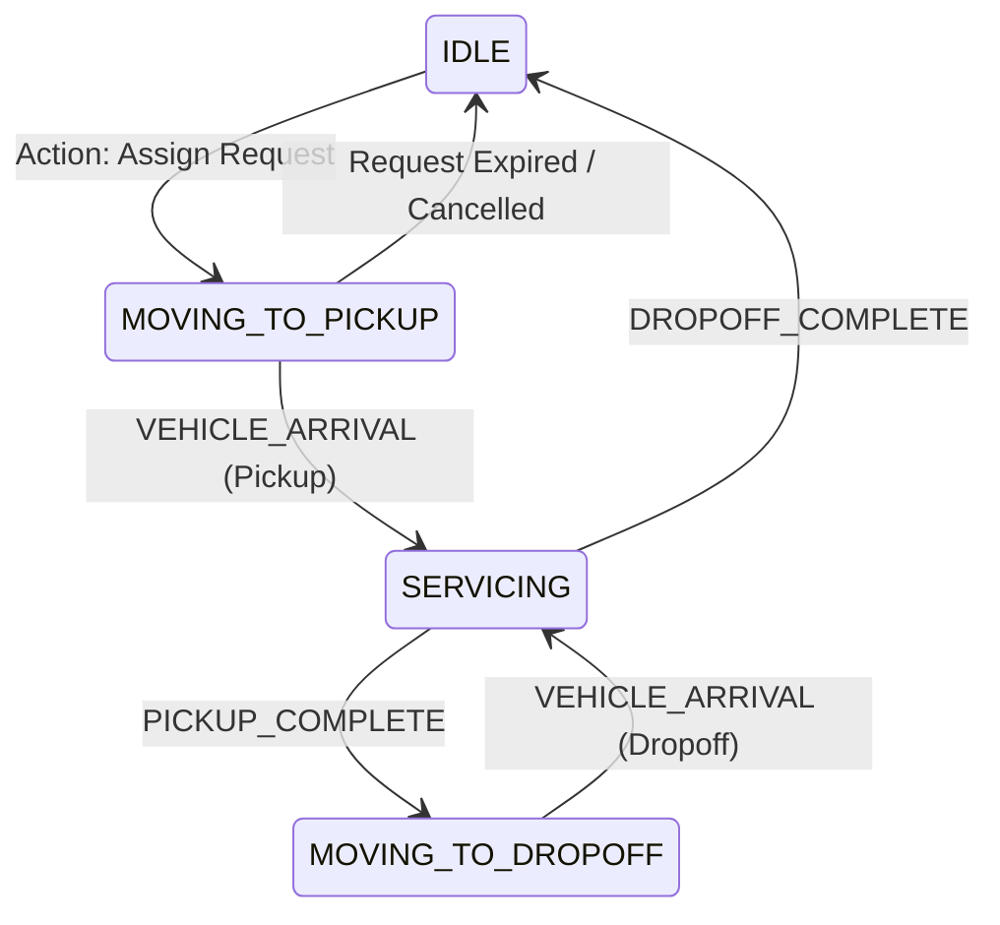

# Dynamic Fleet Environment Design & Mathematical Specification

## 1. Simulation Paradigm: Event-Driven Simulation

Standard RL environments often step at fixed clock intervals ($\Delta t$). For dynamic vehicle routing, this approach is computationally inefficient because vehicles spend extended periods traveling along roads where no dispatch decisions are required.

`DynamicFleetEnv` implements an **event-driven priority queue simulator** (`heapq`). The clock jumps directly from the current time to the exact timestamp of the next critical physical event.

---

## 2. Event Taxonomy

| Event Type | Trigger Condition | State Mutations | Scheduled Subsequent Events |
| :--- | :--- | :--- | :--- |
| `NEW_REQUEST` | Poisson process interval | Ingests new request batch into `requests` map and `pending_requests` list. | Next `NEW_REQUEST`, `REQUEST_EXPIRATION` |
| `VEHICLE_ARRIVAL` | Vehicle completes edge traversal | Updates vehicle node location, transitions vehicle to `SERVICING`. | `PICKUP_COMPLETE` or `DROPOFF_COMPLETE` |
| `PICKUP_COMPLETE` | Service duration ($\tau_s$) elapsed | Marks request `PICKED_UP`, increases vehicle load, deducts fuel. | `VEHICLE_ARRIVAL` at dropoff location |
| `DROPOFF_COMPLETE` | Service duration ($\tau_s$) elapsed | Marks request `DELIVERED`, unloads package, checks SLA compliance. | Vehicle transitions to `IDLE` |
| `TRAFFIC_CHANGE` | Periodic traffic update clock | Recomputes global traffic state and random edge incidents. | Next `TRAFFIC_CHANGE` |
| `REQUEST_EXPIRATION` | Simulation clock $> \text{deadline}$ | Marks request `EXPIRED`, frees assigned vehicle if not yet picked up. | None |

---

## 3. Vehicle State Machine

### Invariants:
1. **Load Conservation**: $0 \le \text{current\_load} \le \text{capacity}$ at all times.
2. **Fuel Monotonicity**: $\text{fuel\_consumed}_{t+1} \ge \text{fuel\_consumed}_t$.
3. **Valid Transitions**: Transitions not listed above raise a descriptive `ValueError`.

---

## 4. Road Network & Traffic Dynamics

### 4.1 City Graph Topology
The city road network is represented as an undirected weighted graph $G = (V, E)$:
- $N = |V|$ nodes placed in a uniform 2D grid of size $L \times L$ km.
- Road distance $d(u, v)$ is the Euclidean distance between nodes.
- Graph connectivity is enforced using minimum spanning tree edges.
- Shortest paths and distances are computed with Dijkstra's algorithm and cached.

### 4.2 Traffic Multipliers
Travel time across an edge $(u, v)$ is calculated as:
$$T(u, v, t) = \frac{d(u, v)}{v_{\text{base}}} \cdot M(t, u, v) \cdot 60 \quad (\text{minutes})$$

Where the multiplier $M(t, u, v)$ combines:
1. **Base Traffic State**:
   - $\text{LOW\_TRAFFIC}$: $0.8\times$
   - $\text{NORMAL\_TRAFFIC}$: $1.0\times$
   - $\text{HEAVY\_TRAFFIC}$: $1.5\times$
   - $\text{CONGESTION}$: $2.5\times$
2. **Rush Hour Windows**: 08:00–10:00 ($2.0\times$) and 17:00–20:00 ($2.5\times$).
3. **Random Congestion Incidents**: Stochastic per-edge bottlenecks lasting 15–45 minutes ($1.5\times$ additional penalty).
4. **Gaussian Noise**: $\epsilon \sim \mathcal{N}(0, \sigma_{\text{noise}}^2)$.

---

## 5. Multi-Objective Reward Formulation

At each decision step $t$, the scalar reward $R_t$ is computed as:

$$R_t = \alpha \cdot N_{\text{deliv}} + \zeta \cdot U_{\text{fleet}} - \beta \cdot D_{\text{km}} - \gamma \cdot F_{\text{fuel}} - \delta \cdot N_{\text{SLA}} - \epsilon \cdot t_{\text{idle}} - \eta \cdot N_{\text{exp}}$$

| Parameter | Symbol | Default Value | Description |
| :--- | :--- | :--- | :--- |
| Delivery Reward | $\alpha$ | $+10.0$ | Reward per completed package delivery |
| Utilization Bonus | $\zeta$ | $+1.0$ | Reward scaled by fleet active load ratio |
| Travel Penalty | $\beta$ | $-0.1$ | Cost per kilometer traveled |
| Fuel Penalty | $\gamma$ | $-0.5$ | Cost per unit of fuel consumed |
| SLA Breach Penalty | $\delta$ | $-20.0$ | Heavy penalty for late delivery |
| Idle Penalty | $\epsilon$ | $-0.05$ | Penalty per minute vehicles spend inactive |
| Expiration Penalty | $\eta$ | $-15.0$ | Penalty for request expiring before pickup |

### Running Normalization:
To stabilize value function estimation in PPO:
$$\hat{R}_t = \text{clip}\left(\frac{R_t - \mu_{R}}{\sigma_{R} + \epsilon}, -10.0, 10.0\right)$$
where $\mu_R$ and $\sigma_R$ are updated with a moving window of past step rewards.
