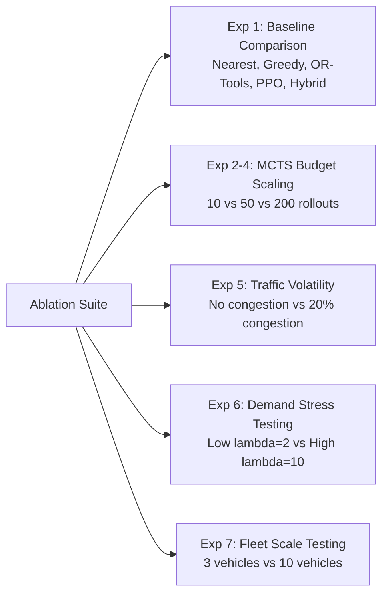

# Experimental Protocol, Benchmarks, & Ablation Studies

## 1. Evaluation Methodology

To ensure rigorous, fair, and reproducible comparison across all dispatching paradigms, every evaluation adheres to the following principles:

1. **Paired Seed Evaluation**: Every dispatcher evaluated on an episode uses identical pseudo-random seeds for city graph generation, initial vehicle placements, request arrival times, and traffic conditions.
2. **True Measurement Integrity**: Latency benchmarks and episode metrics are directly measured on the host environment; no numbers are estimated or hardcoded.
3. **Decoupled Solvers**: Inference and solver computation times are captured using high-resolution hardware timers (`time.perf_counter()`) strictly wrapping the decision calls.

---

## 2. Standardized Metrics

| Metric | Code Key | Formula | Unit |
| :--- | :--- | :--- | :--- |
| **Completion Rate** | `completion_rate` | $\frac{N_{\text{delivered}}}{N_{\text{total\_requests}}}$ | Ratio ($0.0 - 1.0$) |
| **SLA Compliance Rate** | `sla_compliance_rate` | $\frac{N_{\text{on\_time}}}{N_{\text{delivered}}}$ | Ratio ($0.0 - 1.0$) |
| **Average Turnaround Time** | `avg_turnaround_time` | $\frac{1}{N_{\text{delivered}}} \sum (t_{\text{delivery}} - t_{\text{request}})$ | Minutes |
| **Total Fleet Distance** | `total_distance` | $\sum_{v \in V} d_v$ | Kilometers |
| **Total Fuel Consumed** | `total_fuel_consumed` | $\sum_{v \in V} f_v$ | Fuel units |
| **Fleet Utilization** | `fleet_utilization` | $\frac{1}{T} \int_0^T \frac{\sum_v \text{load}_v}{\sum_v \text{capacity}_v} dt$ | Ratio ($0.0 - 1.0$) |
| **Decision Latency** | `avg_inference_latency_ms` | Mean, P50, P95, P99 across decisions | Milliseconds (ms) |

---

## 3. Ablation Experiments Matrix

The testbed defines seven structured ablation experiments executed via [`scripts/run_experiment.py`](file:///K:/Projects/Multi-Fleet%20Manager/dynamic-fleet-routing/scripts/run_experiment.py):



### Experiment Specifications:
1. **Experiment 1 (Baseline Comparison)**: Compares Nearest Vehicle, Greedy Urgency, OR-Tools CP-SAT, and MCTS on the default city topology.
2. **Experiment 2–4 (Search Budget Scaling)**: Evaluates MCTS performance trade-offs:
   - Small budget: 10 simulations, max depth 5, rollout horizon 3.
   - Standard budget: 50 simulations, max depth 10, rollout horizon 5.
   - High budget: 200 simulations, max depth 15, rollout horizon 10.
3. **Experiment 5 (Traffic Volatility)**: Tests robustness under zero congestion ($\text{prob}=0.0$) vs. heavy traffic disruption ($\text{prob}=0.20$).
4. **Experiment 6 (Demand Spikes)**: Evaluates system saturation when demand increases from $\lambda = 2$ to $\lambda = 10$ arrivals per interval.
5. **Experiment 7 (Fleet Density)**: Evaluates fleet scalability from sparse fleets ($V = 3$) to dense fleets ($V = 10$).

---

## 4. Execution Commands

```bash
# Run complete ablation experiments
python scripts/run_experiment.py

# Run latency benchmarks
python scripts/benchmark_latency.py

# Generate offline simulation dataset
python scripts/generate_dataset.py

# Run full baseline evaluation
python -m src.training.evaluate --config configs/base.yaml --n-episodes 5
```
